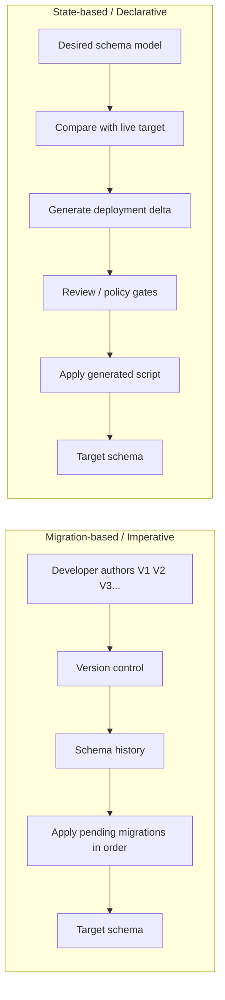
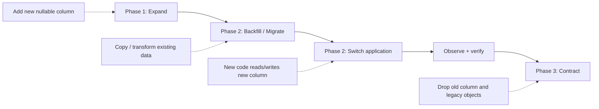
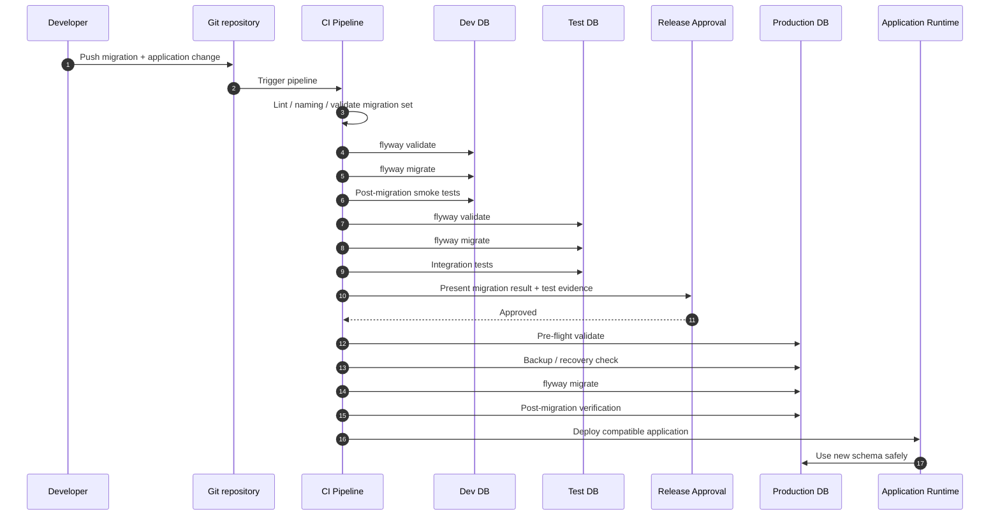

# Flyway and Database Automation
## 4-Hour Hands-On Workshop for Developers and DevOps Engineers

**Format:** 4 hours, instructor-led + hands-on  
**Audience:** Developers and DevOps engineers with basic SQL and CI/CD knowledge  
**Primary database:** Microsoft SQL Server 2022 Developer in Docker  
**Migration engine:** Redgate Flyway 13.7.x-compatible workflow  
**Shell examples:** Bash on Linux/macOS; the lab is also compatible with Docker Desktop on Windows with equivalent shell syntax.

**Production principle:** Treat database changes as deployable software. A migration is code, the schema history is deployment state, and the database itself is production infrastructure.

---

# 1. Workshop Outcomes and Schedule

At the end of the workshop, participants should be able to:

1. Explain why database deployment is harder than application deployment.
2. Compare migration-based and state-based database delivery.
3. Design a production-safe Flyway migration repository.
4. Run versioned and repeatable migrations against SQL Server.
5. Implement an Expand-Contract schema change across multiple releases.
6. Add migration validation and approval gates to CI/CD.
7. Diagnose checksum, duplicate-version, partial-failure, and manual-hotfix problems.
8. Select a safe recovery strategy: fix-forward, undo where appropriate, restore, or PITR.

## 4-Hour Agenda

| Module | Topic | Time | Hands-on checkpoint |
|---|---|---:|---|
| 1 | Database DevOps challenge and migration landscape | 45 min | Choose migration vs. state-based approach for sample changes |
| 2 | Database CI/CD and zero-downtime architecture | 45 min | Design an Expand-Contract release sequence |
| 3 | End-to-end Flyway automation lab | 90 min | Deploy V1-V6 to Dev/Test/Prod simulation |
| 4 | Troubleshooting and disaster recovery lab | 60 min | Recover from four deliberately induced incidents |

## Pacing guidance

Use the concepts as short briefings and spend the majority of time in the terminal. A good rhythm is:

**Explain → demonstrate → learners reproduce → verify → discuss production equivalent.**

Avoid turning the workshop into a Flyway command memorization exercise. The goal is to teach safe deployment patterns that happen to use Flyway.

---

# 2. Module 1 — The Database DevOps Challenge & Migration Landscape
## 45 minutes

### Learning goals

By the end of this module, learners can explain why database delivery creates a different class of deployment problem and can identify where Flyway fits in the database automation landscape.

## 2.1 Why databases become the weak link in DevOps

### Stateful vs. stateless systems

- Application containers are normally replaceable; a database contains durable state.
- Rebuilding an application container is usually cheap; rebuilding a production database may be impossible because data is the product.
- Application deployment often moves binaries between environments; database deployment changes a live stateful system.

### Deployment drift

- Development, test, and production can silently diverge.
- Manual production hotfixes create changes that are invisible to source control.
- A migration repository may say “version 12” while a real database contains an untracked index, column, constraint, or stored procedure.
- The first question before deployment is therefore not only **“What changed?”** but also **“What state is this target actually in?”**

### Manual SQL scripts fail operationally

- Scripts live in chat messages, tickets, desktops, or DBA folders.
- Execution order becomes tribal knowledge.
- Re-running scripts can create duplicate objects or duplicate data.
- “It ran in production” may not mean “it ran in test.”
- There is little reliable evidence of who changed what, when, and against which target.

### Database CI/CD design objective

A production database pipeline should make these properties explicit:

```text
Version-controlled migration code
          ↓
Static/automated validation
          ↓
Disposable database test
          ↓
Controlled promotion
          ↓
Target-specific pre-flight checks
          ↓
Auditable execution
          ↓
Post-deployment verification
          ↓
Recovery path
```

## 2.2 Migration-tool landscape

| Tool / approach | Core model | Typical source of truth | Typical strengths | Typical trade-offs |
|---|---|---|---|---|
| **Flyway** | Migration-based / imperative | Ordered migration scripts + schema history | SQL-first, simple mental model, CI/CD friendly, broad DB support | Developers must design safe forward migrations; drift still needs detection/governance |
| **Liquibase** | Changelog/migration based | XML/YAML/JSON/SQL changelog | Rich change metadata, preconditions, broad workflow features | More abstraction/metadata than SQL-only teams may want |
| **DACPAC / SQL Database Projects** | Declarative / state-based | Desired SQL Server schema model | Excellent SQL Server integration, schema comparison, strong model-centric workflow | Less database-engine agnostic; data-motion changes need separate handling |
| **Atlas** | Primarily declarative / state-based with migration workflows | Desired schema/model plus generated migrations | Strong schema-as-code and diff-driven workflows | Adds a schema-model mindset that teams must govern carefully |

### The decision question

The important architectural choice is not “Which tool is fashionable?” It is:

> **Do we want deployments represented primarily as a sequence of intentional changes, or as a desired end state from which a deployment script is generated?**

Both models can work in enterprise environments. The failure mode is mixing them informally without declaring which one is the source of truth.

## 2.3 Declarative vs. imperative migration model



### Imperative migration mindset

You describe **how to move** from one known state to the next.

Example:

```text
V1 = create customers
V2 = add status
V3 = add order total
V4 = expand with display_name
V5 = backfill display_name
V6 = remove full_name
```

The history itself becomes part of the deployment artifact.

### Declarative/state-based mindset

You describe **what the final state should be**.

Example:

```text
Desired state:
customers.customer_id
customers.display_name
customers.email
customers.status
...
```

The tool compares target state with desired state and determines the necessary change.

### Discussion prompt

> A DBA manually adds an index in production because an urgent query is slow. Which model notices the change more directly, and what governance is required to prevent that index from becoming a permanent undocumented exception?

<details>
  <summary>Expected discussion</summary>
  Neither model magically fixes governance. State-based tools can compare current state more directly; migration-based delivery relies heavily on a trustworthy history and explicit drift detection or reconciliation workflow.  
</details>


## 2.4 Core Flyway concepts

### Versioned migrations — `V...__...sql`

- Applied in version order.
- A specific version is intended to be applied once to a target.
- Flyway records migration metadata in the schema history table.
- Checksums help detect later edits to already-applied SQL.
- The practical enterprise rule is: **do not edit an applied migration; create a new migration and roll forward.** [[Versioned migrations]](https://documentation.red-gate.com/fd/versioned-migrations-273973333.html)

Example naming:

```text
V1__init.sql
V2__add_customer_status.sql
V3__add_order_total.sql
```

### Repeatable migrations — `R...__...sql`

- No version number.
- Re-run when their resolved checksum changes.
- Useful for objects that should reflect the latest definition: views, procedures, functions, or selected reference-data definitions.
- Repeatables do not behave like “version 10”; they are recalculated whenever changed.

Example:

```text
R__customer_directory_view.sql
```

### Undo migrations — `U...__...sql`

- Pair with a versioned migration of the same version.
- Intended to undo the effects of that versioned migration.
- Current Flyway documentation lists the `undo` command and undo migrations as a **Teams** feature.
- Undo is not a replacement for backups or a recovery plan. It also assumes the migration being undone completed successfully; it is not designed to magically reverse a half-applied migration. [[Undo migrations]](https://documentation.red-gate.com/fd/undo-migrations-273973334.html)

Example naming:

```text
V4__expand_customer_display_name.sql
U4__expand_customer_display_name.sql
```

### Baseline

There are two closely related concepts that must not be confused:

1. **The `baseline` command** creates a schema-history starting point for an existing non-empty database.
2. **A baseline migration** uses the `B` prefix to represent a cumulative starting state for new environments.

For an existing database, the baseline version means “assume all history up to this point is already present.” [[Baseline command]](https://documentation.red-gate.com/flyway/reference/commands/baseline) [[Baseline migrations]](https://documentation.red-gate.com/flyway/flyway-concepts/migrations/baseline-migrations)

### `baselineOnMigrate`

This can automatically baseline a non-empty schema with no schema history table before migrating. It is convenient, but the current documentation explicitly warns that enabling it removes a safety net against pointing Flyway at the wrong non-empty database. Use it intentionally, not as a blanket default. [[baselineOnMigrate]](https://documentation.red-gate.com/fd/flyway-baseline-on-migrate-setting-277578974.html)

## 2.5 Forward-only vs. reversible migration strategy

### Forward-only / fix-forward

**Pattern:** detect the problem, restore data if needed, and deploy a new corrective migration.

Advantages:

- Migration history stays append-only.
- Corrective actions are explicitly reviewable.
- Easier to reason about across many environments.
- Works well with backups and PITR.

Costs:

- Requires disciplined design.
- A “rollback” may require a compatibility release rather than a single command.

### Reversible / undo-enabled

**Pattern:** every risky migration has a tested inverse migration.

Advantages:

- Useful during controlled development/testing.
- Can shorten recovery for a known and narrowly scoped change.

Costs:

- Destructive data changes may not be truly reversible.
- A version may have succeeded and then the application may have written new data that the undo script cannot safely reconstruct.
- Current Flyway `undo` is a Teams feature.

### Recommended operating principle

> **Use forward-only migrations as the default production strategy; use backup/PITR as the authoritative data-recovery mechanism; use undo selectively where the inverse is truly safe and tested.**

---

# 3. Module 2 — Database CI/CD Patterns & Architecture
## 45 minutes

## 3.1 Pipeline ordering

A safe default for schema-dependent application changes is:

```text
Build
  ↓
Validate migration set
  ↓
Deploy schema compatibility changes
  ↓
Verify schema
  ↓
Deploy application
  ↓
Run smoke tests
  ↓
Enable new behavior
  ↓
Contract old schema later
```

### Why schema-first matters

Suppose application version `N+1` expects a new column. Deploying application code first can fail immediately if the database has not changed. Adding the column first allows old and new application versions to coexist.

This is the core idea behind Expand-Contract.

## 3.2 Zero-downtime schema evolution: Expand-Contract

### Phase 1 — Expand

Add backwards-compatible database structures.

Example:

```text
OLD: customers.full_name
NEW: customers.full_name + customers.display_name
```

Old application code still works.

### Phase 2 — Migrate / Backfill

Populate the new representation.

Example:

```text
full_name            display_name
-------------------  -------------------
Ada Lovelace   →     Ada Lovelace
Grace Hopper  →      Grace Hopper
```

At scale, treat this as a data-motion operation with its own performance, locking, throttling, and observability strategy. A large backfill inside one Flyway transaction may be technically valid but operationally poor.

### Phase 3 — Switch and Contract

1. Release the application that reads/writes the new column.
2. Observe it in production.
3. Only after no supported application version needs the old column, drop the old column.



### The compatibility rule

At every intermediate release, the database must support **both the old application version and the new application version that could plausibly be running during the rollout**.

## 3.3 Shared databases across microservices

### Safer ownership boundaries

Prefer one of these explicit models:

```text
Service A → Database A
Service B → Database B
```

or, when shared infrastructure is necessary:

```text
Database
├── service_a schema
├── service_b schema
└── shared/reference schema
```

The important property is ownership, not the physical number of databases.

### Rules for shared schemas

- Every object has an owner.
- Only the owning service team changes the schema it owns.
- Cross-service reads should be treated as contracts.
- Avoid direct writes into another service's tables.
- Reference data shared across teams needs explicit lifecycle ownership.
- Schema changes must consider all consumers, not only the team writing the migration.

## 3.4 Security and secrets

### Never commit

- SQL Server SA password.
- Production connection strings.
- Cloud database access tokens.
- Client secrets.
- Long-lived credentials in migration files.

### Prefer

```text
CI secret store / workload identity / managed identity
                    ↓
              short-lived auth
                    ↓
               Flyway job
                    ↓
             target database
```

For local training we intentionally use username/password authentication. In production, use the organization's approved secret manager or identity-based authentication and least-privileged deployment accounts.

## 3.5 Data protection: backups and PITR

A migration pipeline is not a backup system.

### Minimum production controls

- Automated full backups.
- Differential backups where appropriate.
- Transaction log backups when using the full recovery model.
- Restore tests, not just backup-success alerts.
- Defined RPO/RTO.
- A documented recovery owner.
- A target-time recovery procedure.

SQL Server point-in-time recovery requires the correct recovery model and a restore sequence of the full backup plus subsequent differential/log backups as applicable. [[SQL Server PITR]](https://learn.microsoft.com/en-us/sql/relational-databases/backup-restore/restore-a-sql-server-database-to-a-point-in-time-full-recovery-model) [[Complete restores]](https://learn.microsoft.com/en-us/sql/relational-databases/backup-restore/complete-database-restores-full-recovery-model)

## 3.6 Multi-stage CI/CD architecture



## 3.7 What should fail the pipeline?

Examples:

- Migration filename does not follow the naming convention.
- Duplicate migration version.
- `flyway validate` reports checksum mismatch.
- Pending migration cannot be parsed.
- Integration test fails.
- Production target is not in an expected version range.
- Backup/recovery precondition is missing.
- A destructive contract migration is bundled with an application release that could still use the old schema.

---

# 4. Module 3 — Hands-On Lab: End-to-End Automation
## 90 minutes

## Lab objectives

By the end of the lab, learners will have:

- A Dockerized SQL Server.
- A Git-friendly Flyway project.
- V1-V6 migrations.
- An Expand-Contract change.
- Three simulated environments: Dev, Test, Prod.
- A staged deployment script with a production approval gate.

## 4.1 Prerequisites

Install/verify:

- Docker Engine or Docker Desktop.
- Docker Compose v2.
- Git.
- A Bash-compatible shell.
- At least 4 GB available memory for the SQL Server container.
- At least 10 GB free disk space for comfortable lab operation.

Microsoft's current SQL Server Linux container documentation uses `MSSQL_SA_PASSWORD` rather than the deprecated `SA_PASSWORD` environment variable and provides the SQL Server 2022 Linux image used below. [[SQL Server containers]](https://learn.microsoft.com/en-us/sql/linux/quickstart-install-connect-docker)

## 4.2 Create the project

### Step 1 — Create the project directory

```bash
mkdir -p flyway-database-lab/sql flyway-database-lab/conf flyway-database-lab/ci flyway-database-lab/bootstrap flyway-database-lab/backups # Create the Flyway project, configuration, pipeline, bootstrap, and backup directories used throughout the lab.
```

### Step 2 — Enter the project directory

```bash
cd flyway-database-lab # Enter the lab repository so all relative paths below are reproducible.
```

### Step 3 — Initialize Git

```bash
git init # Initialize version control because migration history must be managed with the same discipline as application code.
```

## 4.3 Standard project structure

```text
flyway-database-lab/
├── .env.example
├── .gitignore
├── docker-compose.yml
├── flyway.conf
├── bootstrap/
│   └── 01-create-databases.sql
├── conf/
│   ├── dev.conf
│   ├── test.conf
│   ├── prod.conf
│   └── legacy.conf
├── sql/
│   ├── V1__init.sql
│   ├── V2__add_customer_status.sql
│   ├── V3__add_order_total.sql
│   ├── V4__expand_customer_display_name.sql
│   ├── V5__backfill_customer_display_name.sql
│   └── V6__contract_drop_full_name.sql
└── ci/
    └── deploy.sh
```

> **Naming rule:** Use the default Flyway uppercase `V`, then the version, then two underscores, then a human-readable description. Do not casually rename an already-applied migration.

## 4.4 Environment file

Create `.env.example`:

```dotenv
# Local-only training secret. Do not use this password in any real environment.
MSSQL_SA_PASSWORD=FlywayLab_2026!Strong
```

Create `.gitignore`:

```gitignore
# Local Docker/secret state must not enter source control.
.env

# SQL Server backups can contain production-grade sensitive data and must not be committed.
backups/*.bak
backups/*.trn

# Optional local artifacts.
*.log
```

Copy the example environment file:

```bash
cp .env.example .env # Create the local environment file while keeping the real password out of version control.
```

## 4.5 Docker Compose — SQL Server + Flyway runner

Create `docker-compose.yml`:

```yaml
services:
  sqlserver:
    image: mcr.microsoft.com/mssql/server:2022-latest
    container_name: flyway-sqlserver
    hostname: sqlserver
    environment:
      ACCEPT_EULA: "Y"
      MSSQL_PID: "Developer"
      MSSQL_SA_PASSWORD: "${MSSQL_SA_PASSWORD}"
    ports:
      - "1433:1433"
    volumes:
      - flyway_sqlserver_data:/var/opt/mssql
      - ./bootstrap:/opt/bootstrap:ro
      - ./backups:/var/opt/mssql/backup
    healthcheck:
      test:
        [
          "CMD-SHELL",
          "/opt/mssql-tools18/bin/sqlcmd -S localhost -U sa -P \"$$MSSQL_SA_PASSWORD\" -No -Q \"SELECT 1\" >/dev/null 2>&1"
        ]
      interval: 10s
      timeout: 5s
      retries: 30
      start_period: 20s

  flyway:
    image: redgate/flyway:13.7.0
    profiles: ["tools"]
    working_dir: /flyway/project
    environment:
      FLYWAY_USER: "sa"
      FLYWAY_PASSWORD: "${MSSQL_SA_PASSWORD}"
    volumes:
      - ./:/flyway/project
    depends_on:
      sqlserver:
        condition: service_healthy

volumes:
  flyway_sqlserver_data:
```

The Flyway container image and project-mount pattern follow the current Redgate Flyway Docker documentation. [[Flyway Docker]](https://documentation.red-gate.com/fd/flyway-docker-321585710.html)

## 4.6 Bootstrap SQL Server databases

Create `bootstrap/01-create-databases.sql`:

```sql
-- Create the development database with deterministic logical file names for later restore exercises.
IF DB_ID(N'flyway_dev') IS NULL
BEGIN
    CREATE DATABASE [flyway_dev]
    ON PRIMARY
    (
        NAME = N'flyway_dev_data',
        FILENAME = N'/var/opt/mssql/data/flyway_dev.mdf',
        SIZE = 64MB,
        FILEGROWTH = 64MB
    )
    LOG ON
    (
        NAME = N'flyway_dev_log',
        FILENAME = N'/var/opt/mssql/data/flyway_dev_log.ldf',
        SIZE = 64MB,
        FILEGROWTH = 64MB
    );
END;

-- Create the test database so the same migration artifact can be promoted without changing the SQL files.
IF DB_ID(N'flyway_test') IS NULL
BEGIN
    CREATE DATABASE [flyway_test]
    ON PRIMARY
    (
        NAME = N'flyway_test_data',
        FILENAME = N'/var/opt/mssql/data/flyway_test.mdf',
        SIZE = 64MB,
        FILEGROWTH = 64MB
    )
    LOG ON
    (
        NAME = N'flyway_test_log',
        FILENAME = N'/var/opt/mssql/data/flyway_test_log.ldf',
        SIZE = 64MB,
        FILEGROWTH = 64MB
    );
END;

-- Create the production simulation database with deterministic logical file names for backup/restore training.
IF DB_ID(N'flyway_prod') IS NULL
BEGIN
    CREATE DATABASE [flyway_prod]
    ON PRIMARY
    (
        NAME = N'flyway_prod_data',
        FILENAME = N'/var/opt/mssql/data/flyway_prod.mdf',
        SIZE = 64MB,
        FILEGROWTH = 64MB
    )
    LOG ON
    (
        NAME = N'flyway_prod_log',
        FILENAME = N'/var/opt/mssql/data/flyway_prod_log.ldf',
        SIZE = 64MB,
        FILEGROWTH = 64MB
    );
END;

-- Configure the production simulation for log backups and point-in-time recovery exercises.
ALTER DATABASE [flyway_prod] SET RECOVERY FULL;

-- Create a legacy database to demonstrate onboarding an existing database with Flyway baseline.
IF DB_ID(N'flyway_legacy') IS NULL
BEGIN
    CREATE DATABASE [flyway_legacy]
    ON PRIMARY
    (
        NAME = N'flyway_legacy_data',
        FILENAME = N'/var/opt/mssql/data/flyway_legacy.mdf',
        SIZE = 64MB,
        FILEGROWTH = 64MB
    )
    LOG ON
    (
        NAME = N'flyway_legacy_log',
        FILENAME = N'/var/opt/mssql/data/flyway_legacy_log.ldf',
        SIZE = 64MB,
        FILEGROWTH = 64MB
    );
END;
```

## 4.7 Validate and start the stack

Validate the Compose file before starting anything:

```bash
docker compose config # Resolve Compose variables and catch YAML/interpolation errors before containers are started.
```

Start SQL Server:

```bash
docker compose up -d # Start the SQL Server container in the background so the Flyway lab has a persistent target database.
```

Check container health:

```bash
docker compose ps # Confirm SQL Server is running and its health check has passed before attempting migrations.
```

View SQL Server startup logs if the container is not healthy:

```bash
docker compose logs --tail=100 sqlserver # Inspect recent SQL Server startup output to diagnose password, memory, licensing, or startup failures.
```

Run the bootstrap script:

```bash
docker compose exec -T sqlserver sh -c '/opt/mssql-tools18/bin/sqlcmd -S localhost -U sa -P "$MSSQL_SA_PASSWORD" -No -i /opt/bootstrap/01-create-databases.sql' # Create the Dev, Test, Prod, and Legacy lab databases using the password already injected into the SQL Server container.
```

List the created databases:

```bash
docker compose exec -T sqlserver sh -c '/opt/mssql-tools18/bin/sqlcmd -S localhost -U sa -P "$MSSQL_SA_PASSWORD" -No -Q "SELECT name, state_desc, recovery_model_desc FROM sys.databases WHERE name LIKE '\''flyway_%'\'' ORDER BY name;"' # Verify the lab databases exist and confirm the recovery model used for the production restore exercises.
```

## 4.8 Configure Flyway

Create `flyway.conf`:

```properties
# Keep all migration scripts in the repository's sql directory mounted at /flyway/project inside the Flyway container.
flyway.locations=filesystem:/flyway/project/sql

# Manage the SQL Server dbo schema and place Flyway's schema history table there.
flyway.schemas=dbo
flyway.defaultSchema=dbo

# dbo already exists in SQL Server; do not ask Flyway to create/drop it as part of schema management.
flyway.createSchemas=false

# Make migrate perform a validation pre-flight so edited/missing migrations fail before execution.
flyway.validateOnMigrate=true

# Never allow the destructive clean command in this training configuration; production should also keep this disabled.
flyway.cleanDisabled=true

# Give the database history-table lock enough retry budget for a busy target while still failing rather than hanging forever.
flyway.lockRetryCount=60

# Fail rather than silently applying migrations in a non-sequential order.
flyway.outOfOrder=false
```

Create `conf/dev.conf`:

```properties
# Point the Dev Flyway run at the SQL Server service on the Docker Compose network.
flyway.url=jdbc:sqlserver://sqlserver:1433;databaseName=flyway_dev;encrypt=true;trustServerCertificate=true
```

Create `conf/test.conf`:

```properties
# Point the Test Flyway run at the same SQL Server instance but an isolated database.
flyway.url=jdbc:sqlserver://sqlserver:1433;databaseName=flyway_test;encrypt=true;trustServerCertificate=true
```

Create `conf/prod.conf`:

```properties
# Point the production simulation at a separate database while reusing the exact same migration repository.
flyway.url=jdbc:sqlserver://sqlserver:1433;databaseName=flyway_prod;encrypt=true;trustServerCertificate=true
```

Create `conf/legacy.conf`:

```properties
# Point the baseline exercise at the pre-existing legacy database.
flyway.url=jdbc:sqlserver://sqlserver:1433;databaseName=flyway_legacy;encrypt=true;trustServerCertificate=true

# Mark the legacy schema as being equivalent to migration version 3 during Flyway onboarding.
flyway.baselineVersion=3

# Record why this database was baselined for auditability.
flyway.baselineDescription=legacy-onboarded
```

> **Local-only TLS note:** `encrypt=true;trustServerCertificate=true` demonstrates encrypted transport while trusting the local self-signed certificate. Do not copy `trustServerCertificate=true` into production without an explicit security review; production should validate the server certificate chain.

## 4.9 Step 1 — Initialize and inspect Flyway

Check the Flyway image version:

```bash
docker compose --profile tools run --rm flyway --version # Confirm the Flyway CLI version used by the workshop so behavior can be reproduced consistently.
```

Inspect the Dev target before any migrations exist:

```bash
docker compose --profile tools run --rm flyway info -workingDirectory=/flyway/project -configFiles=/flyway/project/flyway.conf,/flyway/project/conf/dev.conf # Show the target state and confirm Flyway can connect before applying changes.
```

Validate the empty migration repository:

```bash
docker compose --profile tools run --rm flyway validate -workingDirectory=/flyway/project -configFiles=/flyway/project/flyway.conf,/flyway/project/conf/dev.conf # Verify migration discovery, naming, and target connectivity before execution.
```

## 4.10 Step 2 — Author versioned migrations

### `sql/V1__init.sql`

```sql
-- Create the customers table that will be evolved later using Expand-Contract.
CREATE TABLE dbo.customers
(
    customer_id INT IDENTITY(1,1) NOT NULL
        CONSTRAINT PK_customers PRIMARY KEY,
    full_name NVARCHAR(200) NOT NULL,
    email NVARCHAR(320) NOT NULL
        CONSTRAINT UQ_customers_email UNIQUE,
    created_at DATETIME2(3) NOT NULL
        CONSTRAINT DF_customers_created_at DEFAULT SYSUTCDATETIME()
);

-- Create the orders table so later migrations can safely demonstrate a second independent object evolution.
CREATE TABLE dbo.orders
(
    order_id BIGINT IDENTITY(1,1) NOT NULL
        CONSTRAINT PK_orders PRIMARY KEY,
    customer_id INT NOT NULL,
    product_name NVARCHAR(200) NOT NULL,
    quantity INT NOT NULL
        CONSTRAINT CK_orders_quantity_positive CHECK (quantity > 0),
    unit_price DECIMAL(12,2) NOT NULL
        CONSTRAINT CK_orders_unit_price_nonnegative CHECK (unit_price >= 0),
    created_at DATETIME2(3) NOT NULL
        CONSTRAINT DF_orders_created_at DEFAULT SYSUTCDATETIME(),
    CONSTRAINT FK_orders_customer FOREIGN KEY (customer_id) REFERENCES dbo.customers(customer_id)
);

-- Seed a small deterministic dataset so the workshop can demonstrate backfills and verification queries.
INSERT INTO dbo.customers (full_name, email)
VALUES
    (N'Ada Lovelace', N'ada@example.test'),
    (N'Grace Hopper', N'grace@example.test'),
    (N'Linus Torvalds', N'linus@example.test');

-- Seed orders to prove later data changes do not require application downtime in the normal migration sequence.
INSERT INTO dbo.orders (customer_id, product_name, quantity, unit_price)
VALUES
    (1, N'Compiler Notebook', 2, 15.00),
    (2, N'Navigator Toolkit', 1, 125.00),
    (3, N'Kernel T-Shirt', 3, 22.50);
```

### `sql/V2__add_customer_status.sql`

```sql
-- Add the new status column with a safe default so every existing customer remains valid immediately.
ALTER TABLE dbo.customers
ADD status VARCHAR(20) NOT NULL
    CONSTRAINT DF_customers_status DEFAULT 'ACTIVE';

-- Restrict status values so application code can rely on a known domain.
ALTER TABLE dbo.customers
ADD CONSTRAINT CK_customers_status
    CHECK (status IN ('ACTIVE', 'SUSPENDED', 'CLOSED'));
```

### `sql/V3__add_order_total.sql`

```sql
-- Add the computed business value as a nullable column first so existing rows remain compatible during the transformation.
ALTER TABLE dbo.orders
ADD total_amount DECIMAL(12,2) NULL;

-- Backfill the value for all existing orders using data already stored in the row.
UPDATE dbo.orders
SET total_amount = quantity * unit_price
WHERE total_amount IS NULL;

-- Enforce the final invariant after all existing data has been populated.
ALTER TABLE dbo.orders
ALTER COLUMN total_amount DECIMAL(12,2) NOT NULL;
```

Run the first three migrations in Dev:

```bash
docker compose --profile tools run --rm flyway migrate -workingDirectory=/flyway/project -configFiles=/flyway/project/flyway.conf,/flyway/project/conf/dev.conf # Apply V1-V3 in version order and record each successful migration in flyway_schema_history.
```

Inspect the result:

```bash
docker compose --profile tools run --rm flyway info -workingDirectory=/flyway/project -configFiles=/flyway/project/flyway.conf,/flyway/project/conf/dev.conf # Confirm V1-V3 are successful and no unexpected migrations are pending.
```

Verify the schema history table directly:

```bash
docker compose exec -T sqlserver sh -c '/opt/mssql-tools18/bin/sqlcmd -S localhost -U sa -P "$MSSQL_SA_PASSWORD" -No -d flyway_dev -Q "SELECT installed_rank, version, description, type, success FROM dbo.flyway_schema_history ORDER BY installed_rank;"' # Inspect Flyway's audit trail to connect CLI output with the underlying deployment history.
```

Verify the business data:

```bash
docker compose exec -T sqlserver sh -c '/opt/mssql-tools18/bin/sqlcmd -S localhost -U sa -P "$MSSQL_SA_PASSWORD" -No -d flyway_dev -Q "SELECT customer_id, full_name, status FROM dbo.customers ORDER BY customer_id; SELECT order_id, total_amount FROM dbo.orders ORDER BY order_id;"' # Confirm both schema and data transformations completed correctly.
```

## 4.11 Step 3 — Expand-Contract across three releases

### Release 1: Expand

Create `sql/V4__expand_customer_display_name.sql`:

```sql
-- Add a nullable replacement column so the old application can continue reading full_name during the rollout.
ALTER TABLE dbo.customers
ADD display_name NVARCHAR(200) NULL;
```

Deploy only through version 4 in Dev:

```bash
docker compose --profile tools run --rm flyway migrate -target=4 -workingDirectory=/flyway/project -configFiles=/flyway/project/flyway.conf,/flyway/project/conf/dev.conf # Apply only the backwards-compatible Expand step so old application code can continue to run.
```

Verify that both columns exist:

```bash
docker compose exec -T sqlserver sh -c '/opt/mssql-tools18/bin/sqlcmd -S localhost -U sa -P "$MSSQL_SA_PASSWORD" -No -d flyway_dev -Q "SELECT c.name, t.name AS data_type, c.max_length, c.is_nullable FROM sys.columns c JOIN sys.types t ON c.user_type_id=t.user_type_id WHERE c.object_id=OBJECT_ID(N''dbo.customers'') ORDER BY c.column_id;"' # Confirm the Expand release created the new column without removing the old one.
```

### Release 2: Migrate / Backfill

Create `sql/V5__backfill_customer_display_name.sql`:

```sql
-- Backfill only rows that have not yet received the new value so the migration is safe to retry after a controlled interruption.
WHILE 1 = 1
BEGIN
    UPDATE TOP (1000) dbo.customers
    SET display_name = full_name
    WHERE display_name IS NULL;

    -- Stop when the previous batch updated no rows.
    IF @@ROWCOUNT = 0
        BREAK;
END;
```

> **Production caveat:** This loop is useful for the workshop's tiny dataset, but it is still one Flyway migration and therefore one migration execution context. For very large tables, execute backfills as a separately controlled/resumable operational job or design a migration-specific batching strategy. Measure lock duration, log growth, index impact, and replication/CDC effects before running a large backfill.

Deploy through version 5:

```bash
docker compose --profile tools run --rm flyway migrate -target=5 -workingDirectory=/flyway/project -configFiles=/flyway/project/flyway.conf,/flyway/project/conf/dev.conf # Apply the data movement step after the new column is already present.
```

Verify the backfill:

```bash
docker compose exec -T sqlserver sh -c '/opt/mssql-tools18/bin/sqlcmd -S localhost -U sa -P "$MSSQL_SA_PASSWORD" -No -d flyway_dev -Q "SELECT customer_id, full_name, display_name FROM dbo.customers ORDER BY customer_id; SELECT COUNT(*) AS remaining_nulls FROM dbo.customers WHERE display_name IS NULL;"' # Prove the new column contains the expected data and confirm there are no remaining NULL values.
```

### Application release: switch logic

Flyway cannot deploy your application feature flag or runtime code automatically in this basic lab, so represent the application switch explicitly.

**Before the switch:**

```text
Read:  full_name
Write: full_name
```

**During the compatibility window:**

```text
Read:  display_name when present, otherwise full_name
Write: full_name + display_name
```

**After the switch is fully deployed:**

```text
Read:  display_name
Write: display_name
```

> **Key release rule:** Do not run the contract migration until every supported application version has stopped reading or writing the old column.

### Release 3: Contract

Create `sql/V6__contract_drop_full_name.sql`:

```sql
-- Drop the legacy column only after the application has switched completely to display_name and telemetry shows no old consumers remain.
ALTER TABLE dbo.customers
DROP COLUMN full_name;
```

Deploy through version 6:

```bash
docker compose --profile tools run --rm flyway migrate -target=6 -workingDirectory=/flyway/project -configFiles=/flyway/project/flyway.conf,/flyway/project/conf/dev.conf # Complete the Expand-Contract cycle by removing the legacy column after the compatibility window.
```

Verify the final schema:

```bash
docker compose exec -T sqlserver sh -c '/opt/mssql-tools18/bin/sqlcmd -S localhost -U sa -P "$MSSQL_SA_PASSWORD" -No -d flyway_dev -Q "SELECT c.name FROM sys.columns c WHERE c.object_id=OBJECT_ID(N''dbo.customers'') ORDER BY c.column_id;"' # Confirm display_name remains while the legacy full_name column has been removed.
```

Create a known-good Git checkpoint before deliberately breaking migration state in Module 4:

```bash
git add . # Stage the completed core lab so troubleshooting exercises can distinguish repository changes from database changes.
```

```bash
git commit -m "chore: checkpoint before troubleshooting lab" # Record a reproducible source-control baseline before introducing failure scenarios.
```

## 4.12 Optional repeatable migration exercise

A repeatable migration is useful for objects such as a view whose definition should always match the repository.

Create `sql/R__customer_directory_view.sql`:

```sql
-- Recreate the view definition whenever this file changes so the view remains aligned with version-controlled SQL.
CREATE OR ALTER VIEW dbo.v_customer_directory
AS
SELECT
    customer_id,
    display_name,
    email,
    status,
    created_at
FROM dbo.customers;
```

Run the migration engine:

```bash
docker compose --profile tools run --rm flyway migrate -workingDirectory=/flyway/project -configFiles=/flyway/project/flyway.conf,/flyway/project/conf/dev.conf # Apply the repeatable view because its checksum is new in this database.
```

Change only a comment in the repeatable file and run migrate again to observe checksum-driven re-execution:

```bash
docker compose --profile tools run --rm flyway migrate -workingDirectory=/flyway/project -configFiles=/flyway/project/flyway.conf,/flyway/project/conf/dev.conf # Re-run the changed repeatable migration to demonstrate that repeatables are driven by content rather than version numbers.
```

## 4.13 Step 4 — Simulated CI/CD pipeline

The lab promotes the **same repository** through three isolated databases. In a real pipeline, production credentials should be injected by the CI secret mechanism and the production target should be a protected environment.

Create `ci/deploy.sh`:

```bash
#!/usr/bin/env bash

# Stop on command failures, unset variables, and pipeline errors so a failed database deployment cannot be reported as successful.
set -euo pipefail

# Require an explicit environment argument such as dev, test, or prod.
ENVIRONMENT="${1:?Usage: ./ci/deploy.sh <dev|test|prod>}"

# Allow the release to cap the target version during an Expand-Contract rollout.
TARGET_VERSION="${TARGET_VERSION:-6}"

# Execute Flyway in the reproducible container defined by the repository.
flyway_run() {
    docker compose --profile tools run --rm flyway "$@"
}

# Select the target-specific Flyway configuration without modifying the migration files themselves.
case "$ENVIRONMENT" in
    dev)
        CONFIG_FILES="/flyway/project/flyway.conf,/flyway/project/conf/dev.conf"
        ;;
    test)
        CONFIG_FILES="/flyway/project/flyway.conf,/flyway/project/conf/test.conf"
        ;;
    prod)
        CONFIG_FILES="/flyway/project/flyway.conf,/flyway/project/conf/prod.conf"
        ;;
    *)
        echo "Unknown environment: $ENVIRONMENT" >&2
        exit 2
        ;;
esac

# Validate first so checksum, missing-file, duplicate-version, and naming problems fail before migration execution.
flyway_run validate -workingDirectory=/flyway/project -configFiles="$CONFIG_FILES"

# Show the target state to provide evidence before the deployment step.
flyway_run info -workingDirectory=/flyway/project -configFiles="$CONFIG_FILES"

# Require an explicit human approval before production migration in this training simulation.
if [[ "$ENVIRONMENT" == "prod" ]]; then
    read -r -p "Type PROMOTE to migrate production to target ${TARGET_VERSION}: " APPROVAL
    if [[ "$APPROVAL" != "PROMOTE" ]]; then
        echo "Production migration cancelled."
        exit 1
    fi
fi

# Migrate only to the requested target version so Expand, Backfill, and Contract can be promoted as separate releases.
flyway_run migrate -target="$TARGET_VERSION" -workingDirectory=/flyway/project -configFiles="$CONFIG_FILES"

# Record final target state for CI logs and deployment evidence.
flyway_run info -workingDirectory=/flyway/project -configFiles="$CONFIG_FILES"
```

Make the script executable:

```bash
chmod +x ci/deploy.sh # Allow the deployment wrapper to run as a normal repository script in local and CI environments.
```

Promote Release 1 to Dev through the Expand step:

```bash
TARGET_VERSION=4 ./ci/deploy.sh dev # Simulate the first release that makes the schema backwards-compatible without switching application behavior.
```

Promote Release 1 to Test:

```bash
TARGET_VERSION=4 ./ci/deploy.sh test # Validate and promote the same Expand migration to the isolated Test database.
```

Promote Release 1 to Prod with an approval gate:

```bash
TARGET_VERSION=4 ./ci/deploy.sh prod # Promote the same Expand release to the production simulation only after the interactive approval gate.
```

Promote Release 2 through the backfill step:

```bash
TARGET_VERSION=5 ./ci/deploy.sh dev # Promote the backfill step into Dev after compatible application code is available.
```

```bash
TARGET_VERSION=5 ./ci/deploy.sh test # Promote the backfill step into Test after integration validation.
```

```bash
TARGET_VERSION=5 ./ci/deploy.sh prod # Promote the backfill step into the production simulation after approval and pre-flight validation.
```

Promote Release 3 through the contract step **only after the application switch is complete**:

```bash
TARGET_VERSION=6 ./ci/deploy.sh dev # Remove the legacy column in Dev after validating that the application now uses display_name.
```

```bash
TARGET_VERSION=6 ./ci/deploy.sh test # Prove the contract change works in the integration environment before production.
```

```bash
TARGET_VERSION=6 ./ci/deploy.sh prod # Execute the final contract step in production only after the application compatibility window is closed.
```

### Production CI/CD adaptation

For GitLab, GitHub Actions, Azure DevOps, or similar platforms, map the same logical stages to platform-native controls:

```text
validate
  ↓
migrate:dev
  ↓
test / integration
  ↓
migrate:test
  ↓
security / change approval
  ↓
migrate:prod
  ↓
smoke tests / observability
```

Use protected environments for the real production approval rather than an interactive `read` prompt. The shell prompt exists only to make the approval gate visible during this local workshop.

---

# 5. Module 4 — Troubleshooting & Disaster Recovery Lab
## 60 minutes

## Troubleshooting workflow

Use the same five questions for almost every database incident:

1. **What does Flyway think happened?** — inspect `info` and the schema history.
2. **What does the actual database contain?** — query `sys.tables`, `sys.columns`, constraints, indexes, and representative data.
3. **What changed outside Flyway?** — look for hotfixes, DBA scripts, or application side effects.
4. **Can the target be safely brought back to a known state?** — rollback/fix-forward/restore.
5. **How will the corrected state become the new source of truth?** — commit the migration, reconcile drift, and verify downstream environments.

> **Important:** `repair` changes Flyway's recorded history. It does not magically reverse database objects left behind by a failed non-transactional migration. Current documentation explicitly states that failed migration objects left in the database may still require manual cleanup. [[Repair]](https://documentation.red-gate.com/flyway/reference/commands/repair)

---

## Scenario 1 — Failed migration, checksum mismatch, repair, and baseline

### Part A: Reproduce a partial failure

Create `sql/V99__simulate_partial_failure.sql`:

```sql
-- Create an object first so the training scenario leaves a visible database artifact when execution is non-transactional.
CREATE TABLE dbo.partial_failure_demo
(
    demo_id INT NOT NULL CONSTRAINT PK_partial_failure_demo PRIMARY KEY
);

-- Insert one row so learners can prove that the first statement actually committed.
INSERT INTO dbo.partial_failure_demo (demo_id)
VALUES (1);

-- Intentionally fail the migration after the earlier statements have executed.
THIS_IS_NOT_VALID_SQL;
```

Create the companion script configuration file `sql/V99__simulate_partial_failure.sql.conf`:

```properties
# Intentionally execute without one wrapping migration transaction so the lab can demonstrate leftover objects after a failure.
executeInTransaction=false
```

Run the migration:

```bash
docker compose --profile tools run --rm flyway migrate -workingDirectory=/flyway/project -configFiles=/flyway/project/flyway.conf,/flyway/project/conf/dev.conf # Reproduce a controlled failed migration that leaves the earlier statements behind because transaction wrapping was explicitly disabled.
```

Inspect the migration state:

```bash
docker compose --profile tools run --rm flyway info -workingDirectory=/flyway/project -configFiles=/flyway/project/flyway.conf,/flyway/project/conf/dev.conf # Identify the failed V99 entry and compare it with the actual database state.
```

Verify the leftover table:

```bash
docker compose exec -T sqlserver sh -c '/opt/mssql-tools18/bin/sqlcmd -S localhost -U sa -P "$MSSQL_SA_PASSWORD" -No -d flyway_dev -Q "SELECT OBJECT_ID(N''dbo.partial_failure_demo'', N''U'') AS object_id; SELECT * FROM dbo.partial_failure_demo;"' # Prove that database objects can remain even though Flyway recorded the migration as failed.
```

### Repair the history

First remove the bad SQL from `V99__simulate_partial_failure.sql` so the intended migration is clear:

```sql
-- Keep only the intended object definition after the failed experiment is diagnosed.
CREATE TABLE dbo.partial_failure_demo
(
    demo_id INT NOT NULL CONSTRAINT PK_partial_failure_demo PRIMARY KEY
);

-- Keep the seed row because it is part of the intentional lab state.
INSERT INTO dbo.partial_failure_demo (demo_id)
VALUES (1);
```

Now run repair:

```bash
docker compose --profile tools run --rm flyway repair -workingDirectory=/flyway/project -configFiles=/flyway/project/flyway.conf,/flyway/project/conf/dev.conf # Remove the failed history entry so the corrected migration can be evaluated again; repair does not delete the leftover table.
```

Re-check the database artifact:

```bash
docker compose exec -T sqlserver sh -c '/opt/mssql-tools18/bin/sqlcmd -S localhost -U sa -P "$MSSQL_SA_PASSWORD" -No -d flyway_dev -Q "SELECT OBJECT_ID(N''dbo.partial_failure_demo'', N''U'') AS object_id;"' # Confirm the database object still exists after repair, demonstrating that history repair and schema cleanup are separate operations.
```

Remove the leftover object before retrying the corrected migration:

```bash
docker compose exec -T sqlserver sh -c '/opt/mssql-tools18/bin/sqlcmd -S localhost -U sa -P "$MSSQL_SA_PASSWORD" -No -d flyway_dev -Q "DROP TABLE dbo.partial_failure_demo;"' # Remove the artifact left by the intentionally non-transactional failed migration so the corrected script can run cleanly.
```

Re-run the corrected migration:

```bash
docker compose --profile tools run --rm flyway migrate -workingDirectory=/flyway/project -configFiles=/flyway/project/flyway.conf,/flyway/project/conf/dev.conf # Apply the repaired migration now that the database object state matches its pre-migration expectation.
```

### Part B: Reproduce a checksum mismatch

Create `sql/V7__checksum_demo.sql` so the checksum exercise does not alter one of the core V1-V6 workshop migrations:

```sql
-- Create a disposable training object whose migration checksum can be changed safely during this exercise.
CREATE TABLE dbo.checksum_demo
(
    demo_id INT NOT NULL CONSTRAINT PK_checksum_demo PRIMARY KEY
);
```

Apply V7 first:

```bash
docker compose --profile tools run --rm flyway migrate -target=7 -workingDirectory=/flyway/project -configFiles=/flyway/project/flyway.conf,/flyway/project/conf/dev.conf # Record the original V7 checksum in the schema history so the later file edit can be detected.
```

Intentionally change only a comment in the already-applied migration:

```bash
printf '\n-- Training-only non-functional change used to demonstrate checksum handling.\n' >> sql/V7__checksum_demo.sql # Change the migration file without changing database semantics so Flyway has a checksum difference to detect.
```

Run validation:

```bash
docker compose --profile tools run --rm flyway validate -workingDirectory=/flyway/project -configFiles=/flyway/project/flyway.conf,/flyway/project/conf/dev.conf # Demonstrate that Flyway detects the repository checksum no longer matches the applied migration record.
```

**Production-preferred response:** restore the exact applied migration from version control and validate again; do not routinely repair history just because the file was edited.

For the workshop, the comment-only change is deliberately non-functional, so demonstrate history repair after confirming that the actual schema is unchanged.

Use `repair` only when you have verified that the database already matches the intended migration contents and the history metadata itself needs alignment. Current Flyway validation identifies checksum mismatch as a validation failure and recommends either restoring the migration or using `repair` when the change is intentional. [[Validate errors]](https://documentation.red-gate.com/flyway/reference/exit-codes-and-error-codes/validate-error-codes) [[Repair]](https://documentation.red-gate.com/flyway/reference/commands/repair)

For this controlled comment-only lab change, realign the checksum:

```bash
docker compose --profile tools run --rm flyway repair -workingDirectory=/flyway/project -configFiles=/flyway/project/flyway.conf,/flyway/project/conf/dev.conf # Realign Flyway's recorded checksum only after deliberate verification that the applied database semantics match the accepted migration file.
```

Validate again:

```bash
docker compose --profile tools run --rm flyway validate -workingDirectory=/flyway/project -configFiles=/flyway/project/flyway.conf,/flyway/project/conf/dev.conf # Confirm the schema history and repository checksum are aligned again after the deliberate repair.
```

### Part C: Baseline an existing database

Populate the legacy database manually with the state represented by V1-V3.

Create `bootstrap/02-create-legacy-schema.sql`:

```sql
-- Create a representative pre-Flyway schema that is intentionally not accompanied by a Flyway history table.
CREATE TABLE dbo.customers
(
    customer_id INT IDENTITY(1,1) NOT NULL CONSTRAINT PK_legacy_customers PRIMARY KEY,
    full_name NVARCHAR(200) NOT NULL,
    email NVARCHAR(320) NOT NULL CONSTRAINT UQ_legacy_customers_email UNIQUE,
    status VARCHAR(20) NOT NULL CONSTRAINT DF_legacy_customers_status DEFAULT 'ACTIVE',
    created_at DATETIME2(3) NOT NULL CONSTRAINT DF_legacy_customers_created_at DEFAULT SYSUTCDATETIME()
);

-- Create the order table as it exists after the first three logical changes.
CREATE TABLE dbo.orders
(
    order_id BIGINT IDENTITY(1,1) NOT NULL CONSTRAINT PK_legacy_orders PRIMARY KEY,
    customer_id INT NOT NULL,
    product_name NVARCHAR(200) NOT NULL,
    quantity INT NOT NULL CONSTRAINT CK_legacy_orders_quantity_positive CHECK (quantity > 0),
    unit_price DECIMAL(12,2) NOT NULL CONSTRAINT CK_legacy_orders_unit_price CHECK (unit_price >= 0),
    total_amount DECIMAL(12,2) NOT NULL,
    created_at DATETIME2(3) NOT NULL CONSTRAINT DF_legacy_orders_created_at DEFAULT SYSUTCDATETIME(),
    CONSTRAINT FK_legacy_orders_customer FOREIGN KEY (customer_id) REFERENCES dbo.customers(customer_id)
);

-- Seed one row so the database is definitely non-empty before baselining.
INSERT INTO dbo.customers (full_name, email)
VALUES (N'Legacy Customer', N'legacy@example.test');
```

Run the legacy bootstrap script:

```bash
docker compose exec -T sqlserver sh -c '/opt/mssql-tools18/bin/sqlcmd -S localhost -U sa -P "$MSSQL_SA_PASSWORD" -No -d flyway_legacy -i /opt/bootstrap/02-create-legacy-schema.sql' # Create a non-empty legacy database that has no Flyway schema history.
```

Baseline it at version 3:

```bash
docker compose --profile tools run --rm flyway baseline -workingDirectory=/flyway/project -configFiles=/flyway/project/flyway.conf,/flyway/project/conf/legacy.conf # Create Flyway's schema history starting point and declare that legacy version 3 is already present.
```

Inspect the baseline:

```bash
docker compose --profile tools run --rm flyway info -workingDirectory=/flyway/project -configFiles=/flyway/project/flyway.conf,/flyway/project/conf/legacy.conf # Confirm the baseline marker exists and that migrations above the baseline remain eligible for deployment.
```

Apply V4-V6 to the baselined legacy target:

```bash
docker compose --profile tools run --rm flyway migrate -target=6 -workingDirectory=/flyway/project -configFiles=/flyway/project/flyway.conf,/flyway/project/conf/legacy.conf # Apply only migrations newer than the baseline and stop at the end of the core workshop sequence, preserving the pre-existing legacy schema.
```

> **What baseline does not mean:** it does not prove that the legacy database is correct. Before baselining production, compare the real schema against the intended baseline and resolve drift first.

---

## Scenario 2 — Duplicate migration versions from parallel feature branches

Imagine two developers independently create:

```text
V8__add_customer_search_index.sql
V8__add_order_status.sql
```

Flyway requires a unique version; duplicate versions are a repository integration problem, not a database problem. [[Migrations-based approach]](https://documentation.red-gate.com/fd/migrations-based-approach-168984769.html)

Create `sql/V8__feature_a.sql`:

```sql
-- Feature A intentionally uses version 8 for the collision exercise.
SELECT 1 AS feature_a;
```

Create `sql/V8__feature_b.sql`:

```sql
-- Feature B intentionally uses the same version 8 for the collision exercise.
SELECT 1 AS feature_b;
```

Run validation:

```bash
docker compose --profile tools run --rm flyway validate -workingDirectory=/flyway/project -configFiles=/flyway/project/flyway.conf,/flyway/project/conf/dev.conf # Force Flyway to resolve the migration set and expose the duplicate-version conflict before deployment.
```

Resolve the pending branch migration by assigning it a unique version:

```bash
mv sql/V8__feature_b.sql sql/V8.1__feature_b.sql # Give the second not-yet-applied migration a unique sortable version without altering any already-applied migration.
```

Validate again:

```bash
docker compose --profile tools run --rm flyway validate -workingDirectory=/flyway/project -configFiles=/flyway/project/flyway.conf,/flyway/project/conf/dev.conf # Confirm the migration repository is structurally valid after the version collision is resolved.
```

### Branching rules to teach

- Coordinate version allocation in the team.
- Prefer timestamp-like versions or another convention that minimizes collisions.
- Never rename an already-applied production migration just to make Git history pretty.
- Resolve collisions before the migrations reach a shared downstream environment.
- If two conflicting migrations are both semantically valid, merge their database intent into an explicit ordered sequence.

---

## Scenario 3 — Object already exists after a manual hotfix

This is one of the most important production incidents because the database and Git history now disagree.

Create the manual object in Dev:

```bash
docker compose exec -T sqlserver sh -c '/opt/mssql-tools18/bin/sqlcmd -S localhost -U sa -P "$MSSQL_SA_PASSWORD" -No -d flyway_dev -Q "CREATE TABLE dbo.manual_hotfix (hotfix_id INT NOT NULL CONSTRAINT PK_manual_hotfix PRIMARY KEY);"' # Simulate a DBA or emergency engineer creating a table directly in the database outside Flyway.
```

Create `sql/V9__capture_manual_hotfix.sql`:

```sql
-- This migration intentionally collides with the already-created manual object.
CREATE TABLE dbo.manual_hotfix
(
    hotfix_id INT NOT NULL CONSTRAINT PK_manual_hotfix PRIMARY KEY
);
```

Try the migration:

```bash
docker compose --profile tools run --rm flyway migrate -workingDirectory=/flyway/project -configFiles=/flyway/project/flyway.conf,/flyway/project/conf/dev.conf # Reproduce the object-already-exists failure caused by database drift outside the Flyway history.
```

### Preferred remediation path

**Path A — Reconcile the database back to the migration:**

1. Compare the manually created object with the migration.
2. If the hotfix is unnecessary, remove it through the normal approved change process.
3. Run the migration normally.

Remove the manually created object in the lab:

```bash
docker compose exec -T sqlserver sh -c '/opt/mssql-tools18/bin/sqlcmd -S localhost -U sa -P "$MSSQL_SA_PASSWORD" -No -d flyway_dev -Q "DROP TABLE dbo.manual_hotfix;"' # Revert the out-of-band lab change so Flyway can become the source of truth again.
```

Run the migration normally:

```bash
docker compose --profile tools run --rm flyway migrate -workingDirectory=/flyway/project -configFiles=/flyway/project/flyway.conf,/flyway/project/conf/dev.conf # Apply the migration through Flyway and restore alignment between schema state and migration history.
```

### Path B — Capture a validated hotfix as already-applied

Current Flyway documentation provides `skipExecutingMigrations` specifically for bringing an out-of-process change into Flyway change control. It still updates schema history, so it must only be used when the database state has been compared with the migration and proven equivalent. `skipExecutingMigrations` and `cherryPick` are Teams capabilities. [[Skip executing migrations]](https://documentation.red-gate.com/flyway/reference/configuration/flyway-namespace/flyway-skip-executing-migrations-setting)

After recreating the manual object and validating its exact structure, a Teams user can mark only version 9 as applied:

```bash
docker compose --profile tools run --rm flyway migrate -cherryPick=9 -skipExecutingMigrations=true -workingDirectory=/flyway/project -configFiles=/flyway/project/flyway.conf,/flyway/project/conf/dev.conf # Record V9 as applied without executing it again because the equivalent database change already exists.
```

> **Do not use `skipExecutingMigrations` as a shortcut for “Flyway is annoying.”** It is a reconciliation tool for a known database state. The migration still needs to be committed to version control so future environments have the same intent.

---

## Scenario 4 — Emergency rollback or restorative action without losing valid data

### First decision: rollback or restore?

Use **fix-forward** when:

- The bad change is isolated.
- The data is still correct.
- A corrective migration can be deployed safely.

Use **restore/PITR** when:

- Data was corrupted or deleted.
- The wrong migration changed a large amount of state.
- A deterministic corrective script is not trustworthy.
- The business requires restoring the database to a known time.

Use **undo** only when:

- The corresponding undo migration exists.
- The migration fully succeeded.
- The inverse operation is safe for the actual data state.
- The organization's edition and release policy allow it.

### Part A — Take a pre-release full backup

Confirm that Prod uses the full recovery model:

```bash
docker compose exec -T sqlserver sh -c '/opt/mssql-tools18/bin/sqlcmd -S localhost -U sa -P "$MSSQL_SA_PASSWORD" -No -Q "SELECT name, recovery_model_desc FROM sys.databases WHERE name = ''flyway_prod'';"' # Confirm the recovery model before relying on transaction log recovery procedures.
```

Take a full backup:

```bash
docker compose exec -T sqlserver sh -c '/opt/mssql-tools18/bin/sqlcmd -S localhost -U sa -P "$MSSQL_SA_PASSWORD" -No -Q "BACKUP DATABASE flyway_prod TO DISK = ''/var/opt/mssql/backup/flyway_prod_pre_release.bak'' WITH INIT, COMPRESSION;"' # Capture a known-good restore point before the simulated emergency change.
```

Validate the backup media:

```bash
docker compose exec -T sqlserver sh -c '/opt/mssql-tools18/bin/sqlcmd -S localhost -U sa -P "$MSSQL_SA_PASSWORD" -No -Q "RESTORE VERIFYONLY FROM DISK = ''/var/opt/mssql/backup/flyway_prod_pre_release.bak'';"' # Verify that SQL Server can read the backup before treating it as a recovery point.
```

### Part B — Simulate a bad release

Create an explicit transaction mark immediately before the bad change:

```bash
docker compose exec -T sqlserver sh -c '/opt/mssql-tools18/bin/sqlcmd -S localhost -U sa -P "$MSSQL_SA_PASSWORD" -No -d flyway_prod -Q "BEGIN TRANSACTION BadRelease WITH MARK ''BAD_RELEASE''; UPDATE dbo.customers SET status = ''SUSPENDED''; COMMIT TRANSACTION BadRelease;"' # Mark and perform the intentionally bad data change so the restore exercise can recover to just before that transaction.
```

Verify the bad state:

```bash
docker compose exec -T sqlserver sh -c '/opt/mssql-tools18/bin/sqlcmd -S localhost -U sa -P "$MSSQL_SA_PASSWORD" -No -d flyway_prod -Q "SELECT status, COUNT(*) AS customer_count FROM dbo.customers GROUP BY status ORDER BY status;"' # Prove the emergency incident changed live data before beginning recovery.
```

Take a log backup containing the marked transaction:

```bash
docker compose exec -T sqlserver sh -c '/opt/mssql-tools18/bin/sqlcmd -S localhost -U sa -P "$MSSQL_SA_PASSWORD" -No -Q "BACKUP LOG flyway_prod TO DISK = ''/var/opt/mssql/backup/flyway_prod_bad_release.trn'' WITH INIT, COMPRESSION;"' # Preserve the transaction log needed to perform a point-in-time-style recovery against the marked transaction.
```

### Part C — Restore to a separate database first

> **Never make your first recovery attempt by overwriting the only production copy.** Restore to a separate target, validate it, and only then decide how to cut over.

Inspect backup logical file names in a general-purpose production workflow:

```bash
docker compose exec -T sqlserver sh -c '/opt/mssql-tools18/bin/sqlcmd -S localhost -U sa -P "$MSSQL_SA_PASSWORD" -No -Q "RESTORE FILELISTONLY FROM DISK = ''/var/opt/mssql/backup/flyway_prod_pre_release.bak'';"' # Verify the logical data/log file names before using MOVE during a restore.
```

Drop the prior restore target if it exists:

```bash
docker compose exec -T sqlserver sh -c '/opt/mssql-tools18/bin/sqlcmd -S localhost -U sa -P "$MSSQL_SA_PASSWORD" -No -Q "IF DB_ID(N''flyway_prod_restore'') IS NOT NULL BEGIN ALTER DATABASE flyway_prod_restore SET SINGLE_USER WITH ROLLBACK IMMEDIATE; DROP DATABASE flyway_prod_restore; END;"' # Remove only the disposable recovery target so the restore remains isolated from the source database.
```

Restore the full backup without recovery so the log can be applied:

```bash
docker compose exec -T sqlserver sh -c '/opt/mssql-tools18/bin/sqlcmd -S localhost -U sa -P "$MSSQL_SA_PASSWORD" -No -Q "RESTORE DATABASE flyway_prod_restore FROM DISK = ''/var/opt/mssql/backup/flyway_prod_pre_release.bak'' WITH MOVE ''flyway_prod_data'' TO ''/var/opt/mssql/data/flyway_prod_restore.mdf'', MOVE ''flyway_prod_log'' TO ''/var/opt/mssql/data/flyway_prod_restore_log.ldf'', NORECOVERY;"' # Restore the known-good full backup into a separate database while keeping the restore sequence open for log recovery.
```

Restore the log and stop immediately before the marked bad release transaction:

```bash
docker compose exec -T sqlserver sh -c '/opt/mssql-tools18/bin/sqlcmd -S localhost -U sa -P "$MSSQL_SA_PASSWORD" -No -Q "RESTORE LOG flyway_prod_restore FROM DISK = ''/var/opt/mssql/backup/flyway_prod_bad_release.trn'' WITH STOPBEFOREMARK = ''BAD_RELEASE'', RECOVERY;"' # Roll the restored database forward only to the transaction immediately before the deliberately marked bad release.
```

Verify restored data:

```bash
docker compose exec -T sqlserver sh -c '/opt/mssql-tools18/bin/sqlcmd -S localhost -U sa -P "$MSSQL_SA_PASSWORD" -No -d flyway_prod_restore -Q "SELECT status, COUNT(*) AS customer_count FROM dbo.customers GROUP BY status ORDER BY status;"' # Confirm the recovery target contains the pre-incident data state without destroying the original database.
```

Verify Flyway history on the restored database:

```bash
docker compose exec -T sqlserver sh -c '/opt/mssql-tools18/bin/sqlcmd -S localhost -U sa -P "$MSSQL_SA_PASSWORD" -No -d flyway_prod_restore -Q "SELECT installed_rank, version, description, success FROM dbo.flyway_schema_history ORDER BY installed_rank;"' # Confirm the recovered database also contains the expected migration history at the recovery point.
```

### Production cutover discussion

In a real incident:

1. Freeze or quiesce writes as required by the recovery strategy.
2. Establish the exact incident and recovery target.
3. Restore to a separate target first.
4. Validate data integrity, schema version, application compatibility, and critical business queries.
5. Decide whether to cut over, restore in place, or use a controlled data reconciliation.
6. Preserve the original evidence and backups until incident closure.
7. Document the corrective Flyway migration if the recovered state exposes a permanent schema change.

SQL Server's documented PITR process relies on a full backup followed by the required differential/log sequence and recovery at the chosen point. The `STOPAT`/mark-based example above is a training adaptation that illustrates the same restore-sequence discipline while making the cutoff deterministic. [[SQL Server PITR]](https://learn.microsoft.com/en-us/sql/relational-databases/backup-restore/restore-a-sql-server-database-to-a-point-in-time-full-recovery-model) [[Restore to a new location]](https://learn.microsoft.com/en-us/sql/relational-databases/backup-restore/restore-a-database-to-a-new-location-sql-server)

---

# 6. Production Safety Checklist

Use this as the final 5-minute checklist before a real database deployment.

## Migration design

- [ ] Migration is small enough to review.
- [ ] The migration has a unique version.
- [ ] Applied migrations were not edited.
- [ ] Destructive changes have explicit approval.
- [ ] Data-motion changes have a performance plan.
- [ ] Locking and index impact were considered.
- [ ] Application compatibility during the rollout is proven.

## Pipeline

- [ ] `validate` passes.
- [ ] Integration tests pass on a disposable or representative database.
- [ ] The same migration artifact is promoted between environments.
- [ ] Production is a protected environment.
- [ ] Credentials are injected, not committed.
- [ ] Migration output is retained as deployment evidence.
- [ ] Post-deployment verification is automated.

## Database protection

- [ ] Backup status is healthy.
- [ ] Restore procedures are documented and tested.
- [ ] PITR capability matches the business RPO.
- [ ] Recovery owner is known.
- [ ] A contract migration has a compatibility window and observability evidence.

## Drift and emergencies

- [ ] Manual hotfixes are recorded immediately.
- [ ] Drift is reconciled back into source control.
- [ ] `repair` is used only for history correction, not as a magic rollback.
- [ ] The team knows when to fix forward and when to restore.
- [ ] Emergency restore is first validated on a separate target when practical.

---

# 7. Trainer Troubleshooting Matrix

| Symptom | Likely cause | First diagnostic | Safe response |
|---|---|---|---|
| Checksum mismatch | Applied migration was edited | `validate` | Restore original migration; use `repair` only for a verified intentional metadata realignment |
| Duplicate migration version | Parallel branches created the same version | `validate` / migration resolution | Assign a unique version before shared deployment |
| Object already exists | Manual hotfix or partial failed migration | `info` + inspect `sys.objects` | Reconcile target state; optionally mark as applied only after proving equivalence and using the supported feature/edition |
| Failed migration | SQL error, permissions, lock, or incompatible schema | `info`, logs, database metadata | Determine whether transaction rollback occurred; clean leftover objects if needed; repair history only after cleanup decision |
| Non-empty DB with no history table | Flyway introduced to existing DB without onboarding | `info` / migration error | Baseline after validating the existing state |
| Migration applied out of order | Branch/versioning pattern or late-arriving script | `info` | Prefer ordering discipline; do not use out-of-order behavior casually in production |
| Production deployment fails after some targets succeed | Fleet rollout partially completed | Compare `info` on targets | Stop, assess target-by-target state, fix forward or restore according to the incident plan |
| Application breaks after schema release | Schema was contracted too early | Deployment timeline + application logs | Restore compatibility if possible; reopen compatibility window; avoid dropping required objects |

---

# 8. Suggested Live Exercises and Discussion Questions

## Exercise A — Design review

Give learners this requirement:

> Rename `customers.full_name` to `display_name` on a busy system with 24/7 traffic.

Ask them to propose three releases rather than one.

Expected structure:

```text
Release 1 → Add display_name
Release 2 → Backfill + dual-write + switch reads
Release 3 → Drop full_name
```

## Exercise B — Incident classification

Present these symptoms:

```text
1. Flyway says checksum mismatch.
2. SQL Server says object already exists.
3. Migration failed but a table remains.
4. Data was overwritten by a bad release.
```

Ask learners to classify the correct tool/problem domain:

```text
1 → Migration history integrity
2 → Database drift / out-of-band change
3 → Transaction / partial execution handling
4 → Data recovery / backup / PITR
```

## Exercise C — Production go/no-go

Ask:

> A destructive migration is valid, tests pass, but the production backup job failed two hours ago. Do you deploy?

Expected answer for discussion: the issue is not whether the SQL is syntactically correct. The deployment has lost a recovery control and should follow the organization's change/recovery policy rather than silently proceeding.

---

# 9. Instructor Notes: Common Anti-Patterns

### Anti-pattern 1 — “Just edit the migration”

Why it fails:

- The checksum changes.
- A downstream target may already contain the old version.
- Two databases can now have the same migration version but different SQL semantics.

Preferred:

```text
Applied V7 → never edit V7
          ↓
Create V8 with the corrective change
```

### Anti-pattern 2 — “Use repair until Flyway stops complaining”

Why it fails:

- History can become internally consistent while the actual schema is still wrong.
- `repair` changes metadata, not arbitrary schema objects.

Preferred:

```text
Diagnose → compare DB + repository → decide cleanup/reconciliation → repair history only if justified
```

### Anti-pattern 3 — “Rollback means restore the previous code”

Why it fails:

- The application can change data that cannot be undone by reverting the container image.
- A schema migration may have irreversible data effects.

Preferred:

```text
Rollback application behavior
       +
Schema compatibility
       +
Data recovery plan
```

### Anti-pattern 4 — “Run the big backfill inside the deployment window”

Why it fails:

- Long locks.
- Large transaction-log growth.
- Increased replication/CDC pressure.
- Unexpected impact on indexes and I/O.

Preferred:

Treat large data movement as an operational workload with throttling, observability, restartability, and a clear completion criterion.

### Anti-pattern 5 — “Shared database means shared write access”

Why it fails:

- Ownership becomes unclear.
- A service can break another service by changing a table without contract coordination.

Preferred:

Define schema/object ownership and consumer contracts explicitly.

---

# 10. Workshop Takeaway Model

A production-grade database delivery system can be summarized as:

```text
             ┌───────────────────────┐
             │ Version-controlled SQL│
             └───────────┬───────────┘
                         ↓
             ┌───────────────────────┐
             │ validate + policy     │
             └───────────┬───────────┘
                         ↓
             ┌───────────────────────┐
             │ disposable test DB    │
             └───────────┬───────────┘
                         ↓
             ┌───────────────────────┐
             │ compatible schema     │
             │ before new app code   │
             └───────────┬───────────┘
                         ↓
             ┌───────────────────────┐
             │ staged promotion      │
             │ + approval gates      │
             └───────────┬───────────┘
                         ↓
             ┌───────────────────────┐
             │ backup + observability│
             └───────────┬───────────┘
                         ↓
             ┌───────────────────────┐
             │ verify + reconcile    │
             └───────────┬───────────┘
                         ↓
             ┌───────────────────────┐
             │ contract later        │
             └───────────────────────┘
```

The operational mindset is:

> **Schema changes are releases. Data changes are releases. Recovery is part of the deployment design, not an incident-only activity.**

---

# 11. Quick Reference — Core Flyway Command Set Used in This Workshop

The commands below are the small set learners should remember conceptually:

```text
info       → What does Flyway think the target state is?
validate   → Does history match the repository?
migrate    → Apply pending migrations.
repair     → Correct Flyway schema-history metadata after deliberate diagnosis.
baseline   → Establish a starting history for an existing non-empty database.
undo       → Reverse the most recent versioned migration where supported and genuinely safe.
```

Current Flyway documentation also recommends validating migration history as part of CI/CD and using the schema history table as the source of migration execution state for migrations-based deployments. [[Flyway schema history]](https://documentation.red-gate.com/fd/flyway-schema-history-table-273973417.html) [[Migrations-based deployment guidance]](https://documentation.red-gate.com/flyway/deploying-database-changes-using-flyway/rolling-out-updates-from-a-single-schema-to-multiple-production-databases)

---

# 12. References

1. Redgate Flyway — Flyway 13.7.0 release notes: https://documentation.red-gate.com/fd/release-notes-for-flyway-engine-179732572.html
2. Redgate Flyway — Commands: https://documentation.red-gate.com/flyway/reference/commands
3. Redgate Flyway — Versioned migrations: https://documentation.red-gate.com/fd/versioned-migrations-273973333.html
4. Redgate Flyway — Schema history table: https://documentation.red-gate.com/fd/flyway-schema-history-table-273973417.html
5. Redgate Flyway — Repair: https://documentation.red-gate.com/flyway/reference/commands/repair
6. Redgate Flyway — Baseline: https://documentation.red-gate.com/flyway/reference/commands/baseline
7. Redgate Flyway — Baseline migrations: https://documentation.red-gate.com/flyway/flyway-concepts/migrations/baseline-migrations
8. Redgate Flyway — Undo migrations: https://documentation.red-gate.com/fd/undo-migrations-273973334.html
9. Redgate Flyway — Migration transaction handling: https://documentation.red-gate.com/fd/migration-transaction-handling-273973399.html
10. Redgate Flyway — Flyway Docker: https://documentation.red-gate.com/fd/flyway-docker-321585710.html
11. Redgate Flyway — Configuration formats: https://documentation.red-gate.com/flyway/database-development-using-flyway/updating-configurations
12. Microsoft Learn — Run SQL Server containers on Linux: https://learn.microsoft.com/en-us/sql/linux/quickstart-install-connect-docker
13. Microsoft Learn — SQL Server point-in-time restore: https://learn.microsoft.com/en-us/sql/relational-databases/backup-restore/restore-a-sql-server-database-to-a-point-in-time-full-recovery-model
14. Microsoft Learn — Complete database restores: https://learn.microsoft.com/en-us/sql/relational-databases/backup-restore/complete-database-restores-full-recovery-model
15. Microsoft Learn — Restore database to a new location: https://learn.microsoft.com/en-us/sql/relational-databases/backup-restore/restore-a-database-to-a-new-location-sql-server

---

# Appendix A — Optional GitLab CI skeleton

If the workshop is being delivered with GitLab, the local shell stages map cleanly to a CI definition like the following. Replace the image/tag and secret mechanism with the organization's approved baseline.

```yaml
stages:
  - validate
  - migrate_dev
  - test
  - migrate_test
  - migrate_prod

variables:
  FLYWAY_IMAGE: "redgate/flyway:13.7.0"

validate:
  stage: validate
  image: "$FLYWAY_IMAGE"
  script:
    # Validate migration history/naming before any database-changing job is allowed to run.
    - flyway validate

migrate_dev:
  stage: migrate_dev
  image: "$FLYWAY_IMAGE"
  script:
    # Apply the same migration artifact to the development database.
    - flyway migrate

integration_tests:
  stage: test
  script:
    # Run application/database integration tests against the migrated test fixtures.
    - ./ci/run-integration-tests.sh

migrate_test:
  stage: migrate_test
  image: "$FLYWAY_IMAGE"
  script:
    # Promote the same migration set to Test after validation and integration tests.
    - flyway migrate

migrate_prod:
  stage: migrate_prod
  image: "$FLYWAY_IMAGE"
  environment:
    name: production
  when: manual
  allow_failure: false
  script:
    # Production should use protected CI secrets or workload identity rather than a committed password.
    - flyway validate
    # Apply the approved migration only after the platform-level manual gate is satisfied.
    - flyway migrate
```

> For a real GitLab pipeline, configure the production environment as protected and supply database credentials from GitLab's protected variables, an external secret manager, or identity federation. Keep the database migration job separate from the application rollout if the application requires the Expand-Contract compatibility window.

# Appendix B — Reset the Entire Lab

Only do this for the training environment because it destroys the local SQL Server volume.

Stop the stack and remove the SQL Server data volume:

```bash
docker compose down -v # Destroy the local lab databases and volumes so the exercises can be repeated from a clean state.
```

Start the database again:

```bash
docker compose up -d # Recreate the SQL Server container and a fresh empty data volume for another workshop run.
```

Re-run the bootstrap script:

```bash
docker compose exec -T sqlserver sh -c '/opt/mssql-tools18/bin/sqlcmd -S localhost -U sa -P "$MSSQL_SA_PASSWORD" -No -i /opt/bootstrap/01-create-databases.sql' # Recreate the isolated training databases after the full lab reset.
```

---

## End of Workshop

A team that can answer these five questions has a usable database deployment practice:

1. **What migration is going to run?**
2. **How do we know this target is ready for it?**
3. **How do old and new application versions coexist?**
4. **How do we know the change actually succeeded?**
5. **How do we recover if the database or data is wrong?**

Flyway solves the migration-history and deployment-repeatability problem. Production safety still comes from engineering discipline around compatibility, access control, observability, backup/restore, and ownership.
